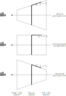
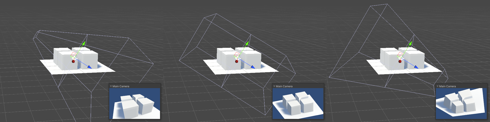

# Reverse Perspective Camera for OpenGL (Three.js)

This example demonstrates how to construct a custom OpenGL projection matrix
that allows a smooth transition between three types of projection:
direct perspective, orthographic projection, and reverse perspective.

For background, see https://en.wikipedia.org/wiki/Reverse_perspective.  
This visual effect is somewhat similar to the well-known "Dolly zoom" (https://en.wikipedia.org/wiki/Dolly_zoom), but more radical in nature.

**Try it live:** [https://bntre.github.io/reverse-perspective-threejs/](https://bntre.github.io/reverse-perspective-threejs/)

**Demo video:** [https://www.youtube.com/watch?v=_5xI7a7cxBg](https://www.youtube.com/watch?v=_5xI7a7cxBg)


## Frustum

In this approach, the camera position becomes irrelevant when the projection changes.  
What really matters is how the frustum shape is transformed.

The type of perspective is defined by the inclination angle of a single projection ray: 
 - p > 0 corresponds to direct perspective
 - p = 0 corresponds to orthographic projection
 - p < 0 corresponds to reverse perspective

Within the usual near and far clip planes, a so-called focus plane is introduced. As the projection changes, the size of this plane remains constant.






## Matrix

It is convenient to define the projection matrix by placing the camera at the center of the focus plane (so that the _near_ < 0 and the _far_ > 0), and by defining _p_ as the tangent of the angle of the projection ray passing through the point _(1, 0, 0)_.

The resulting projection matrix has the following form:

```
  [ Sx  0   0   0
    0   Sy  0   0
    0   0   A   B
    0   0   -p  1 ]
```

The values _A_ and _B_ are computed so that the _z_ coordinate in the range _[near, far]_ maps to _[-1, 1]_ in clip space.

See the updateProjectionMatrix() function for details:  
https://github.com/bntre/reverse-perspective-threejs/blob/main/index.html#L60

For more information about projection matrices, refer to the excellent article by Song Ho Ahn: https://www.songho.ca/opengl/gl_projectionmatrix.html


## Credits

- Animated models from three.js examples  
    (the models are not included in this repo; they are loaded at runtime from the three.js repository):
  - [Michelle](https://threejs.org/examples/?#webgpu_skinning) by [Mixamo](https://www.mixamo.com/#/?query=Michelle&type=Character)
  - [Littlest Tokyo](https://threejs.org/examples/#webgl_animation_keyframes) by [Glen Fox](https://www.artstation.com/artwork/1AGwX)
